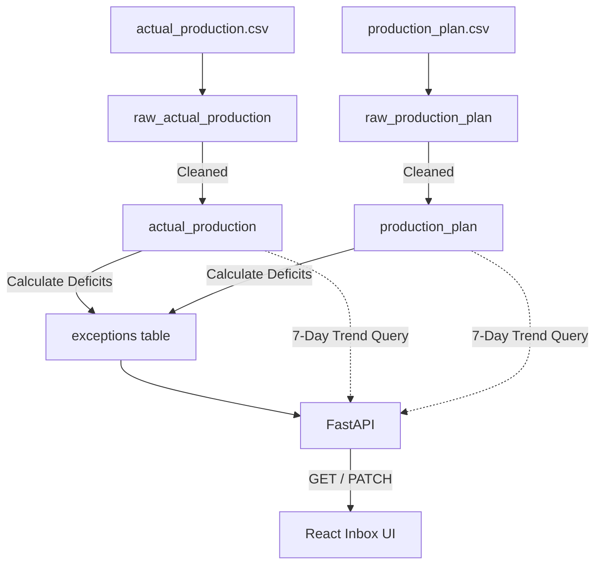

# Approach: Mini Exception Inbox

## Problem Breakdown

The task was decomposed into three main phases:
1. **Data Ingestion & Cleaning**: Inspecting the raw Kaggle datasets, handling bad data, and loading them into a relational structure.
2. **Exception Detection API**: Defining the business logic to identify deficits, persisting them to an `exceptions` table, and serving them via FastAPI endpoints with 7-day trend calculations.
3. **Frontend Inbox**: Building a React UI to visualize the exceptions on a daily grouped timeline, complete with filters and actionable status updates.

Each phase took roughly a third of the overall time, with special attention paid to making the ingestion and detection scripts fully idempotent so the pipeline could be re-run safely without corrupting state.

## Process Flow Diagram

## Data Decisions

During the initial data inspection phase, several quirks were identified and handled:
- **Duplicates**: The `production_plan.csv` contained 13 exact duplicate rows. These were dropped to prevent skewed plan expectations.
- **Invalid Targets**: Found 3 rows with `planned_units <= 0` and 2 rows with nulls in the plan. These were dropped since an exception requires a valid, positive production target.
- **Mismatched Date Ranges**: The actual production data only ran through Q1 (2017-01-01 to 2017-03-31), whereas the plan data ran for a full year. We actively chose to **skip** plan rows without matching actuals rather than treating them as 0 units produced. Treating them as 0 would have flooded the inbox with 9 months of false-positive "future" exceptions.

## Schema & Why

- `raw_production_plan` & `raw_actual_production`: Stores the exact CSV data untouched. Separating raw data allows us to audit ingestion and recover if our cleaning logic changes.
- `production_plan` & `actual_production`: The cleaned, typed tables where column names are normalized and invalid rows are stripped.
- `exceptions`: The materialized table storing the computed deficits and the operational `status` (`open`, `acknowledged`, `resolved`). Re-calculating exceptions on-the-fly would make tracking status changes impossible.

## API Design Notes

- **Idempotency**: The `detect_exceptions.py` script was designed to update existing exception numbers without overwriting the `status` column, ensuring operators don't lose their work if the pipeline runs twice.
- **Sorting**: The API natively sorts exceptions by `date DESC` and `deficit_pct DESC` to keep the frontend payload perfectly ordered for the timeline view out of the box.

## Tradeoffs & Shortcuts

- **No ORM Relationships**: Kept SQLAlchemy models flat to strictly follow the "no over-abstraction" rule. Direct queries were fast enough for this scale.
- **Single Script Runner**: Built a small `run.py` script using `subprocess` to boot both FastAPI and Vite simultaneously, avoiding the overhead of Dockerizing the whole stack while still providing a one-command startup experience.

## Next Steps

If given more time, I would:
- Add a lightweight charting library (like Recharts) for the 7-day trend instead of an HTML table.
- Implement server-side pagination for the `/exceptions` endpoint if the dataset were to grow significantly.
