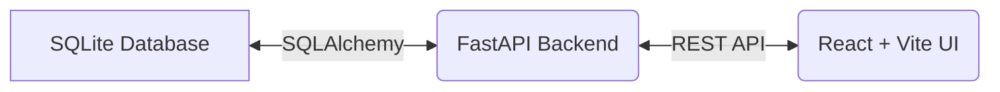

# Architecture — Mini Exception Inbox

## System Overview

This application ingests raw CSV production plans and actuals, identifies days where production fell significantly below plan, and serves these exceptions via a REST API. A React frontend provides operators with a grouped, filterable daily timeline to acknowledge and resolve these issues.

## Architecture Diagram



## Tech Stack

| Layer | Technology | Reason |
|-------|-----------|--------|
| Database | **SQLite** | Zero setup, file-based, perfectly suited for this scale. |
| Backend | **FastAPI (Python)** | Fast, built-in validation (Pydantic), and extremely lightweight. |
| Frontend | **React + Vite** | Extremely fast dev loop, simple component model, vanilla CSS. |
| DevOps | **Docker / Compose** | 100% reproducible execution environment. |

## Database Schema

We maintain a strict separation between raw data and cleaned operational data:

```
raw_production_plan      raw_actual_production
         │                          │
         ▼                          ▼
  production_plan          actual_production
         │                          │
         └───────────┬──────────────┘
                     ▼
                 exceptions
```
- **Raw Tables**: Unmodified reflection of the CSVs.
- **Clean Tables**: Normalized column names, duplicates/nulls dropped.
- **Exceptions Table**: Materialized rows representing a deficit, tracking the workflow `status` (open, acknowledged, resolved).

## Project Structure

```
├── backend/
│   ├── main.py              # FastAPI endpoints
│   ├── models.py            # SQLAlchemy schema
│   ├── database.py          # SQLite setup
│   ├── ingest.py            # CSV loading & cleaning script
│   ├── detect_exceptions.py # Business logic script
│   └── Dockerfile
├── frontend/
│   ├── src/                 # React components
│   └── Dockerfile
├── candidate_pack/          # Raw data
└── docker-compose.yml       # One-command Docker orchestration
```

## Key Decisions

- **SQLite over Postgres**: Avoids a heavy database container for a small-scale, local test.
- **React + Vanilla CSS**: Kept the frontend incredibly light without needing to configure Tailwind or Material UI, sticking to the assignment constraints.
- **Data Cleaning**: Handled 13 duplicate rows in the plan and explicitly avoided logging "0 produced" exceptions for the 9 months where actual data wasn't provided.
- **What to improve**: With more time, a real charting library (like Recharts) would be used for the 7-day trend instead of a basic HTML table.

## Running the Project

### Option A: The Easy Way (Docker) ⭐️

You can run the entire system—database ingestion, backend API, and frontend UI—with a single command:

```bash
docker-compose up --build
```
*The UI will be automatically available at `http://localhost:5173`*

### Option B: Local Native Setup

1. **Install Requirements**:
   Ensure you have Python 3.9+ and Node.js installed.
   ```bash
   pip install fastapi uvicorn sqlalchemy pandas pydantic
   cd frontend && npm install && cd ..
   ```

2. **Generate the Database**:
   Run the data pipeline to load the CSVs and detect exceptions.
   ```bash
   python backend/ingest.py
   python backend/detect_exceptions.py
   ```

3. **Start the Application**:
   Run the unified startup script from the root directory.
   ```bash
   python run.py
   ```
